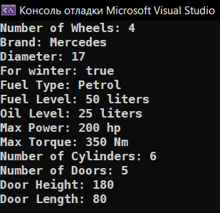
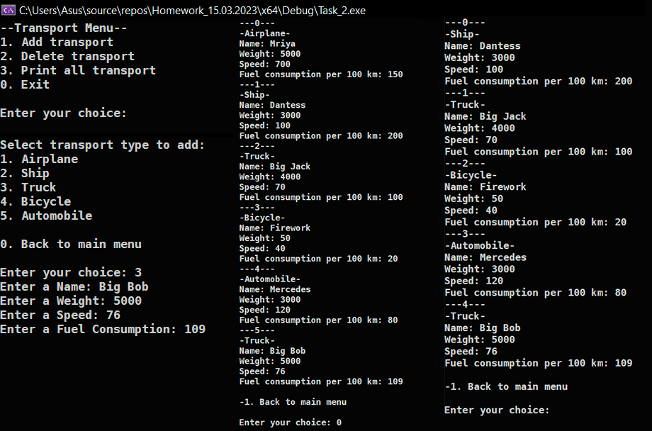

# Homework_15.03.2023
Д/з: Transport

<a href="https://gist.github.com/SlavikArt/6655b47134d9d353b6a037ff02e77ba8">Gist - страница со всеми кодами проектов</a>

## Task 1
* [Task_1 folder](Task_1)
* [Task_1.cpp](main/Task_1.cpp)

- [Car.cpp](main/Car.cpp)
- [Wheels.cpp](main/Wheels.cpp)
- [Engine.cpp](main/Engine.cpp)
- [Door.cpp](main/Door.cpp)

* [Car.h](main/Car.h)
* [Wheels.h](main/Wheels.h)
* [Engine.h](main/Engine.h)
* [Door.h](main/Door.h)

    

    

## Task 2
* [Task_2 folder](Task_2)
* [Task_2.cpp](main/Task_2.cpp)

- [Transport.cpp](main/Transport.cpp)
- [TransportMenu.cpp](main/TransportMenu.cpp)
- [Airplane.cpp](main/Airplane.cpp)
- [Ship.cpp](main/Ship.cpp)
- [Truck.cpp](main/Truck.cpp)
- [Bicycle.cpp](main/Bicycle.cpp)
- [Automobile.cpp](main/Automobile.cpp)

* [Transport.h](main/Transport.h)
* [TransportMenu.h](main/TransportMenu.h)
* [Airplane.h](main/Airplane.h)
* [Ship.h](main/Ship.h)
* [Truck.h](main/Truck.h)
* [Bicycle.h](main/Bicycle.h)
* [Automobile.h](main/Automobile.h)

    

    

